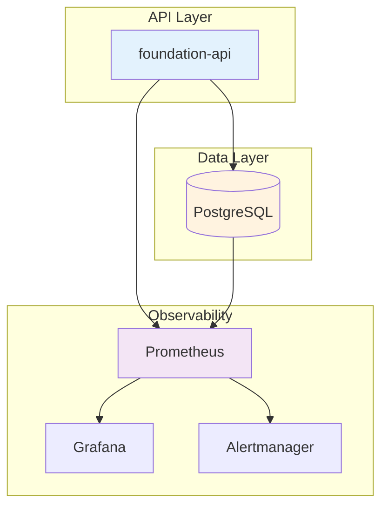

# Architecture Overview

## Components

| Component | Purpose |
|-----------|---------|
| `@foundation/api` | Express.js REST API with metrics |
| `@foundation/db` | PostgreSQL schema for ML resources |
| `@foundation/metrics` | Prometheus metrics (HTTP + ML) |
| `@foundation/logger` | Structured Pino logging |
| `@foundation/core` | Error classes and utilities |

## Resource Types

| Type | Description |
|------|-------------|
| `speech_to_text` | STT/ASR models |
| `text_to_speech` | TTS synthesis |
| `voice_biometrics` | Speaker verification |
| `llm` | Language models |
| `rag` | Retrieval-augmented generation |

## Inference Flow

1. Request → API with API key
2. API → Validate with Zod
3. API → Log inference start
4. API → Run ML model
5. API → Log inference end (duration, status)
6. Response → Client
7. Prometheus scrapes metrics
